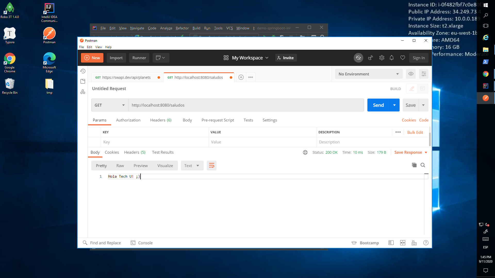
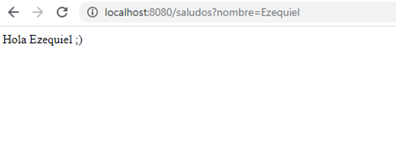

summary: GET (con y sin parámetros)
id: APIEX04
categories: API
tags: back
status: Published 
authors: TechU
Feedback Link: http://bbva-techuniversity.appspot.com/

# APIEX04 - GET (con y sin parámetros)
<!-- ------------------------ -->
## Overview 
Duration: 45

##### APIEX04 - GET (con y sin parámetros)

Crea una clase controller que responda a peticiones GET sin y con parámetros.

```java
package com.techu.holamundo;

import org.springframework.web.bind.annotation.GetMapping;
import org.springframework.web.bind.annotation.RequestParam;
import org.springframework.web.bind.annotation.RestController;

@RestController
public class ResourceController {

    @GetMapping("/saludos")
    public String saludar(@RequestParam(value="nombre",
                                       defaultValue="Tech U!")
                         String name){
        return String.format("Hola %s ;)", name);
    }

}
```

- **@GetMapping** esta anotación indica el método que indica lo que hará la petición GET en  la ruta /saludos. Es una abreviación de **@RequestMapping(method = RequestMethod.GET)** para decorar el método **saludar**.
- **@RequestParam** indicará que **nombre** es un parámetro que estamos esperando recibir en la petición y además le daremos un valor por defecto. Los parámetros que anotemos con @RequestParam son requeridos spor defecto.

Por último ejecutamos la aplicación y en el navegador probamos la dos rutas:

Sin parámetros: 	http://localhost:8080/saludos



Con parámetro: 	http://localhost:8080/saludos?nombre=Ezequiel



RETOS:

- Annotation's attributes: name, value, required, y defaultValue.
- Probar con más de un parámetro

REFERENCIAS:

https://www.baeldung.com/spring-request-param